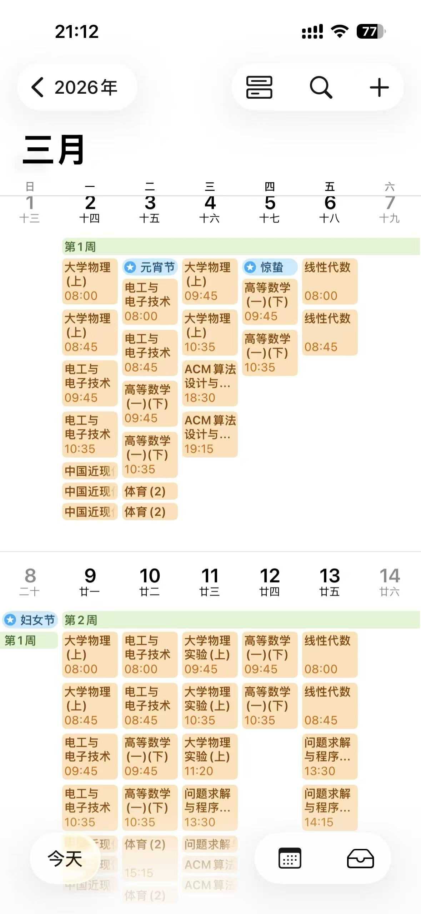

# CCZU-Course-To-ICS

本项目是专门为常州大学学生设计的基于python的课表工具。可以自动从教务系统抓取个人课表并将其转换为标准的.ics格式，方便导入iphone

## 功能亮点

- 自动爬取
1. 基于selenium实现模拟登录（主要是快开学了，时间不够逆），一键获取教务系统课表。另外还可以获取到你暗恋的人的课表，欢迎尝试。
-  智能解析
1. 自动处理单双周逻辑

2. 自动识别特定周次的课表
- 标准导出
1. 生成符合RFC 5545标准的ICS文件
   
   ## 快速开始

一、安装依赖

```python
pip install -r requirements.txt
```

二、 准备浏览器驱动

1. 本项目使用chrome浏览器

2. 确保已下载的驱动与你的chrome浏览器一致并配置好位置

三、 运行程序（由于即将开学，所以没整理代码，一个一个运行吧）

```python
python catch.py
# 获取xlsx课表
python transf.py
# 转换课程
python zc.py
# 添加周次
```

## 注意事项

- 如果没有下载成功xlsx文件的话，请保证你的chrome浏览器是否阻拦了下载；如果阻拦，请关闭安全设置或者自己到点击（所以我没做无头浏览器处理）

- 开学刚写，有些入口没改，可以自己改

- 快开学了，未提供ics to calenda的shortcuts

- -欢迎提issue

## 开源协议

本项目采用MIT License协议
